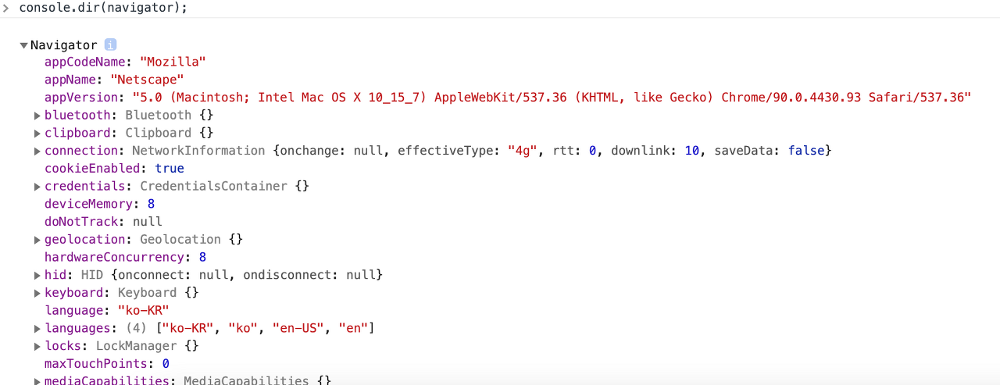
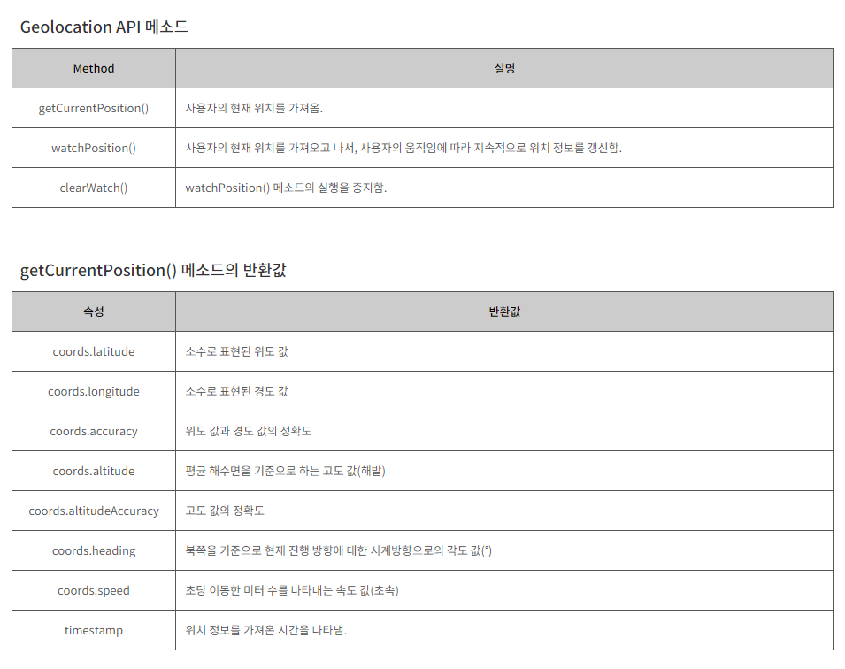

## Navigatior객체 & Geolocation API

<br>

### 1. Navagator객체

- 브라우저의 정보(제품명, 버전)를 제공하는 객체다. 

```javascript
console.dir(navigatior);

```
<br>

> 결과



<br>

### 2. geolocation API
- ```geolocation API ```는 사용자의 현재 위치 정보를 가져올 때 사용하는 자바스크립트 API이다.
-  ```geolocation API```는 ```navigator.geolocation``` 객체를 통해 사용할 수 있다.




