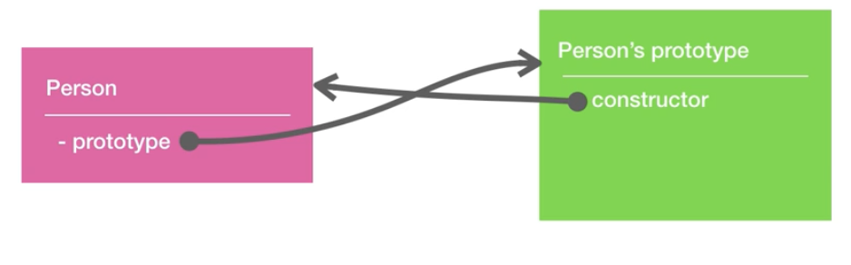
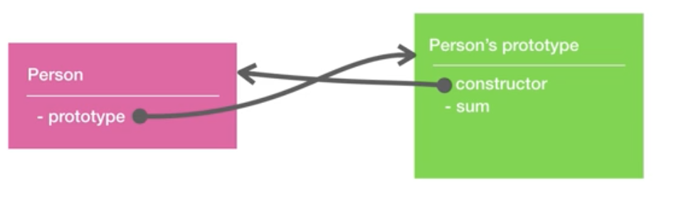
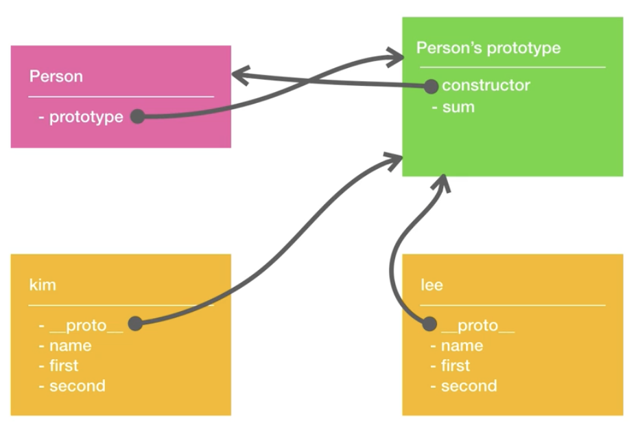
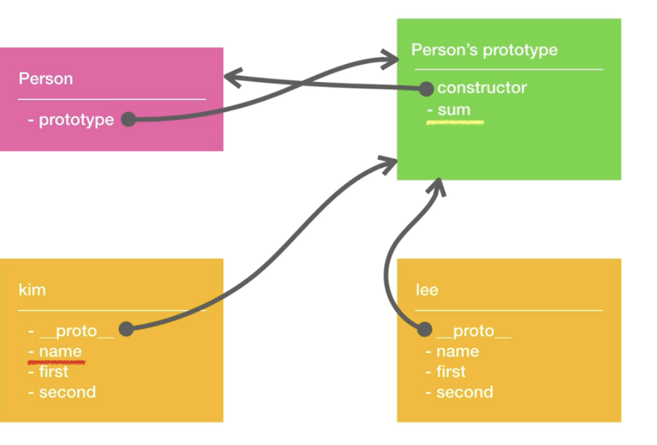

#  prototype과 __proto__의 관계

<br>

```javascript
function Person(){}

let Person = new Function();
```
- 자바스크립트는 함수의 **객체**이다.
- **프로퍼티**를 가질 수 있고 위와 같이 나타낼 수 있다. 

<br>

## 함수 생성

```javascript
// 함수 생성
function Person(name,first,second){
  this.name = name;
  this.first = first;
  this.second = second;
}

```
- 위와 같이 ```Person```라는 함수를 생성하면 **```Person```객체** 와 **```Person```의 ```prototype```객체**가 생성된다. 


- **```Person```객체의 프로퍼티인 prototype**은  **```Person```의 ```prototype```객체**를 가리킨다.
- **```Person```의 ```prototype```객체의 ```constructor```프로퍼티**에 **Person 객체**를 기록한다.
- 즉, 서로를 참조하는 상태가 된다. 

<br>

## 메소드 추가

```javascript
function Person(name,first,second){
  this.name = name;
  this.first = first;
  this.second = second;
}

//메소드 추가
Person.prototype.sum = function(){} 

```


- **```Person```의 ```prototype```객체**에 ```sum```메소드가 추가된다.
- **```Person```의 ```prototype```객체**  = ```Person.prototype```로 나타낼 수 있다.


<br>


## 생성자를 이용한 새로운 객체 생성
```javascript
function Person(name,first,second){
  this.name = name;
  this.first = first;
  this.second = second;
}

Person.prototype.sum = function(){}

// 생성자를 이용한 객체 생성
let Kim = new Person('kim',10,20)
let lee = new Person('lee',10,10)

```


- ```kim```이라는 객체는 **```constructor```함수가 실행**되면서 **```this```값이 세팅된 프로퍼티 값**들이 생성되고, **```__proto__```라는 프로퍼티**도 생성된다. 
- ```__proto__```의 값으로 해당 객체를 생성한 생성자인 **```Person```의 ```prototype```객체**를 가리킨다.

<br>

## 객체에서 메소드나 프로퍼티 호출
```javascript
function Person(name,first,second){
  this.name = name;
  this.first = first;
  this.second = second;
}

Person.prototype.sum = function(){}

let Kim = new Person('kim',10,20)
let lee = new Person('lee',10,10)

// 메소드 호출
kim.sum();

```


- 먼저, **해당 객체 ```kim```에 호출하려는 값이 있는지 살핀다.** 
- 없다면, **그 객체의 ```__proto__```프로퍼티가 가르키는** 객체를 생성한 **생성자의 ```porototype```객체에서 호출**하려는 값을 찾는다.

<br>

## 마무리
- **```Person.prototype```** 를 통해서 **```Person```의 ```prototype```객체**에 접근할수 있고, ```kim.__proto__```를 통해서도 **```Person```의 ```prototype```객체**에 접근할 수 있다.

```javascript
Person.prototype === Kim.__proto__ //true

```


