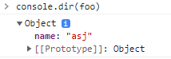
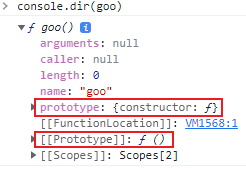

## 1. Prototype 이란?
- **자바스크립트의 모든 객체는 prototype이라는 객체를 가지고 있다.** 
- 모든 객체는 그들의 prototype으로부터 프로퍼티와 메소드를 상속 받는다.
- 자바스크립트의 모든 객체는 최소한 하나 이상의 다른 객체로 부터 상속을 받으며, 이때 **상속되는 정보를 제공하는 객체를 prototype**이라고 한다.
- **부모 객체**를 가르켜 **Prototype 객체** 또는 **prototype** 이라고 한다.

```
📌 prototype을 사용하는 이유
     - 생성자 함수로 생성된 객체 모두에 프로퍼티, 메서드를 공유하기 위해서이다.
     - 상속을 구현 할 수 있다. 
```     


<br>

## 2. __proto__와 prototype 프로퍼티
- ```__proto__```  와 ```prototype```은 **프로퍼티**이며, 이 두 프로퍼티가 가르키는 객체를 **prototype 객체**라고 한다. 
- ```__proto__``` 는 **크롬 브라우저**에서 사용하는 프로퍼티명 이며, **ECMA Sctipt**에는 ```[[Prototype]]```이라는 이름으로 사용한다.

<br>

```javascript
const foo = {
     name: 'asj',
}

function goo(){}

console.dir(foo)
console.dir(goo)

```
<br>

> 결과 



<br>




- **```__proto__```**
     - 모든 객체가 갖고 있는 프로퍼티
     - 부모의 prototype 프로퍼티에 대한 정보를 의미
- **```prototype```**
     - 함수만 갖고 있는 프로퍼티 ( 함수도 객체이므로 ```__proto__``` 를 갖고 있음 )
     - 자신의 prototype 객체이며 자식 객체는 이를 참조함 

<br>

## 3. prototype chain
- 객체의 속성에 접근하려면 ```객체.프로퍼티 이름``` 으로 접근할 수 있다. 
- 특정 객체의 프로퍼티나 메소드 접근시 만약 **현재 객체의 해당 프로퍼티가 존재하지 않는다면**,  
  ```__proto__```가 가리키는 링크를 따라 **부모 역할을 하는 프로토타입 객체**의 프로퍼티나 메소드를 차례로 검색하는 것이 **프로토타입 체인** 이다.
- 모든 프로토타입 체이닝의 종점은 ```Object.prototype```이다.

