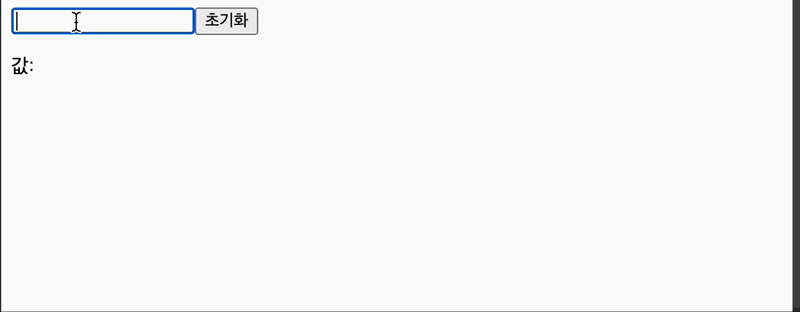

## input상태 관리하기

```useState```를 이용하여 input의 상태 관리하는 방법을 알아보도록 하자.

<br>

> InputSample.js
```javascript
import { useState } from 'react';

const InputSmaple = () => {
  const [text, setText] = useState('');
  
  const onChange = (e) => {
    setText(e.target.value);
  }
  
  const onReset = (e) => {
    setText('');
  }

  return(
      <>
        <input onChange={onChange} value={text} />
        <button onClick={onReset}>초기화</button>
        <p>값:{text}</p>
      </>  
  )
}

export default InputSample;


```

 
 
- 구현내용
  - input에 입력한 값이 하단에 나타나고, 초기화 버튼을 누르면 input값이 없어지도록 구현한다.
- input onChange이벤트
  - 이벤트를 등록하는 함수에서 이벤트 객체인 ```e```를 파라미터로 받아와서 사용한다.
  - ```e.target```은 이벤트가 발생한 input을 가르키게 된다.
  - ```e.target.value```는 현재 input에 입력한 값이 무엇인지 알수 있다.
- input value 값을 ```useState```를 통해서 관리하기
  - ```setText(e.target.value);``` 에서 변화하는 input의 value값을 ```setText```를 통해서 변경해주고 변경된 값을 ```text```로 넘겨준다.
- inputd의 value값 설정해주기
  - input에 있는 value값을 ```{text}```로 설정해주어야 text의 값이 바뀌었을 때 input의 값이 바뀔 수 있다.
  - ``` <input value = {text} / >```를 설정해 주지 않으면 초기화 버튼을 눌렀을 때 설정해 둔 ```onReset```이벤트가 실행되지 않아 input창이 비워지지 않는다. 
  - 따라서, input의 value값을 state에 맞게 설정해주는 것이 중요하다.

