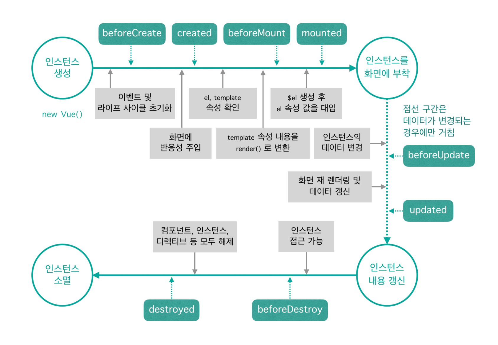
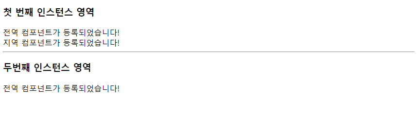
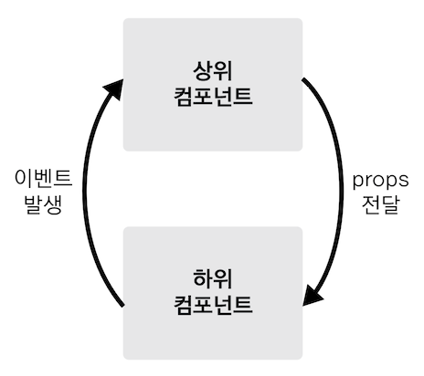
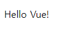
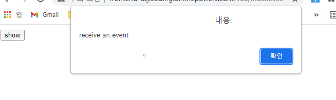
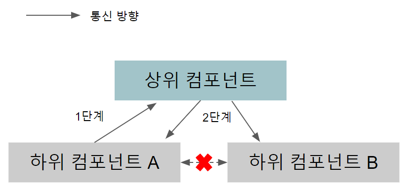
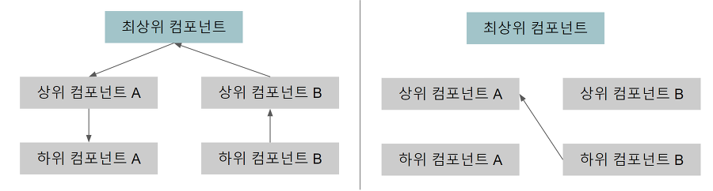
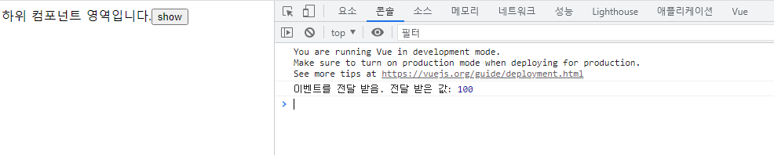

# 💡인스턴스 & 컴포넌트

## 📝목차 
[01. 뷰 인스턴스](#01-뷰-인스턴스)


[02. 뷰 컴포넌트](#02-뷰-컴포넌트)


[03. 뷰 컴포넌트 통신](#03-뷰-컴포넌트-통신)


<br><br>

## 01. 뷰 인스턴스 
### 01-1. 뷰 인스턴스의 정의와 속성
* 뷰로 화면을 개발하기 위해 필수적으로 생성해야하는 기본 단위
```javascript

new Vue({
	...
});

```
* 생성자 : 객체를 새로 생성할 때 자주 사용하는 옵션과 기능들을 미리 특정 개체에 저장해 놓고, 새로 개체를 생성할 때 기존에 포함된 기능과 더불어 기존 기능을 쉽게 확장하여 사용하는 기법

### 01-2. 뷰 인스턴스 옵션 속성
* **template** : 화면에 표시할 HTML, CSS 등의 마크업 요소를 정의하는 속성
* **methods** : 화면 로직 제어와 관계된 메서드를 정의하는 속성, 마우스 클릭 이벤트 처리와 같이 화면의 전반적인 이벤트와 화면 동작과 관련된 로직을 추가 할 수 있다.
* **created** : 뷰 인스턴스가 생성되자마자 실행할 로직을 정의할 수 있는 속성

### 01-3. 뷰 인스턴스의 유효 범위
* el 속성으로 지정한<div id="app">태그 아래 오는 요소들로 제한, <div> 바깥에 있는 {{ message }}는 인식하지 못함
```javascript

new Vue({
	el : '#app',
  	data :  {
    	message : 'Hello Vue.js!'
  }
});

```
	
```html
  <div id="app"></div>
  {{ message }}
```  

### 01-4. 뷰 인스턴스 라이프 사이클
* 라이프 사이클: 인스턴스 상태에 따라 호출할 수 있는 속성들
* 라이프 사이클 단계: 생성 -> 부착 -> 갱신 -> 소멸


		
- **beforeCreate**
: 인스턴스가 생성되고 나서 가장 처음으로 실행되는 라이프 사이클 단계, data속성과 metods속성이 아직 정의되어 있지 않고, 돔과 같은 화면 요소에 접근할 수 없음 

- **created** 
: data속성과 metods속성에 정의된 값에 접근하여 로직을 실행 할 수 있지만, 인스턴스가 화면요소에 부착되기 전이기 때문에 template속성에 정의된 돔 요소로 접근할 수 없음

- **beforeMount**
: template속성에 지정한 마크업 속성을 render()함수로 변환 후 el속성에 지정한 화면 요소에 인스턴스를 부착하기 전에 호출되는 단계

- **mounted**
: el속성에 지정한 화면 요소에 인스턴스가 부착되면 호출되는 단계

- **beforeUpdate**
: el속성에서 지정한 화면 요소에 인스턴스가 부착되고 나면 인스턴스에 정의한 속성들이 화면에 지환

- **updated**
: 데이터가 변경되고 나서 가상 돔으로 다시 화면을 그리고 나면 실행되는 단계 (데이터 변경이 일어나 화면이 다시 그려졌을 때 호출됨)

- **beforeDestroy** 
: 뷰 인스턴스가 파괴되기 직전에 호출되는 단계, 아직 인스턴스에 접근할 수 있음 

- **destroy**
: 뷰 인스턴스가 파괴되고 나서 호출되는 단계, 뷰 인스턴스에 정의된 모든 속성이 제거되고 하위에 선언한 인스턴스들 또한 모두 파괴된다
  

<br><br>

## 02. 뷰 컴포넌트
### 02-1. 컴포넌트 란?
* 조합하여 화면을 구성할 수 있는 블록

### 02-2. 컴포넌트 등록하기
* **전역 컴포넌트** 
```javascript
Vue.component('컴포넌트 이름', {
	// 컴포넌트 내용
});
```
	
* **지역 컴포넌트** : 인스턴스 component 속성을 추가하고 등록할 컴포넌트 이름과 내용을 정의
```javascript
new Vue({
	components: {
		'컴포넌트 이름' :  컴포넌트 내용
	}	
});
```
	
### 02-3. 지역 컴포넌트와 전역 컴포넌트의 차이 
```html
<div id="app>
        <h3>첫 번째 인스턴스 영역</h3>
        <!-- 전역 컴포넌트 표시 -->
        <my-component></my-component> 
        <!-- 지역 컴포넌트 표시 -->
        <my-local-component></my-local-component> 
</div>
 <hr>
<div id="app2">
    <h3>두번째 인스턴스 영역</h3>
    <!-- 전역 컴포넌트 표시 -->
    <my-component></my-component> 
    <!-- 지역 컴포넌트 표시 -->
    <my-local-component></my-local-component> 
</div>

<script>
    //전역 컴포넌트 등록
    Vue.component('my-component' ,{
        template: '<div>전역 컴포넌트가 등록되었습니다!</div>'
    });

    //지역 컴포넌트 등록
    var cmp = {
        template:'<div>지역 컴포넌트가 등록되었습니다!</div>' //컴포넌트 내용
    };

    new Vue({
        el:'#app',
        components:{ // 지역 컴포넌트 등록
            'my-local-component': cmp
        }
    });
    new Vue({
        el:'#app2' 
    });
</script>	

```

	      
* 컴포넌트는 각각 고유한 유효 범위를 갖고 있기 때문에 직접 다른 컴포넌트의 값을 참조할 수 없다
* 따라서 뷰 프레임워크 자체에서 정의한 컴포넌트 데이터 전달 방법을 따라야한다
* 상위(부모) - 하위(자식) 컴포넌트 간의 데이터 전달 방법을 쓴다
	
<br><br>

## 03. 뷰 컴포넌트 통신 
### 03-1. 상하위 컴포넌트 관계
* 컴포넌트는 각각 고유한 유효 범위를 갖고 있기 때문에 직접 다른 컴포넌트의 값을 참조할 수 없다. 따라서 뷰 프레임워크 자체에서 정의한 컴포넌트 데이터 전달 방법을 따라야 한다. 
* 가장 기본적인 데이터 전달 방법은 **상위(부모)-하위(자식)**컴포넌트 간의 데이터 전달 방법이다.

	      
### 03-2. 상위에서 하위 컴포넌트로 데이터 전달하기	      
* props는 상위 컴포넌트에서 하위 컴포넌트로 데이터를 전달할 때 사용하는 속성
```javascript
Vue.component('child-component', {
	porps:['props 속성 이름'],
});      
```
```html
<child-component v-bind:props 속성 이름 = "상위 컴포넌트의 data 속성"></child-component> 	      
```
							
#### ☝ v-bind 란??
* 아이디, 클래스, 스타일 등의 HTML속성 값에 뷰 데이터 값을 연결 
```html
<p v-bind:id = "idA">아이디 바인딩</p>
<p v-bind:class = "classA">클래스 바인딩</p>
<p v-bind:style = "styleA">스타일 바인딩</p>
<script>
	new Vue({
		el: '#app',
		data: {
		   idA: 10,
		   classA: 'container',
		   styleA: 'color:blue'
		}	
	});
</script> 
```							
* 'v-bind:' 문법을 ':'로 간소화 할 수 있다.
			  
```html
   <div id="app">
        <child-component v-bind:propsdata ="message"></child-component>
    </div>

    <script src="https://cdn.jsdelivr.net/npm/vue/dist/vue.js"></script>
    <script>
        Vue.component('child-component',{
            props : ['propsdata'],
            template:'<p>{{propsdata}}</p>',
        });

        new Vue({
            el: '#app',

            data:{
                message: 'Hello Vue!'
            }
        });
    </script>
```
							      
			
	           
### 03-3. 하위에서 상위 컴포넌트로 이벤트 전달하기	      
* 상위 컴포넌트에서 하위 컴포넌트의 특정 이벤트가 발생하기를 기다리고 있다가 하위 컴포넌트에서 특정 이벤트가 발생하면 상위 컴포넌트에서 해당 이벤트를 수신하여 상위 컴포넌트의 메서드를 호출
							      
```javascript
// 이벤트 발생							      
this.$emit('이벤트명');							      
							      
```
```html							      
// 이벤트 수신
<child-component v-on:이벤트명 = "상위 컴포넌트의 메서드명"></child-component>							      
```							      
* $emit()을 호출하면 괄호 안에 정의된 이벤트가 발생한다. 
* $emit()을 호출하는 위치는 하위 컴포넌트의 특정 매서드 내부이다. 따라서 $emit()을 호출할 때 사용하는 this는 하위 컴포넌트를 가리킨다.
* 호출한 이벤트는 하위 컴포넌트를 등록하는 태그에서 v:on으로 받는다.
* 하위 컴포넌트에서 발생한 이벤트명을  v-on: 속성에 지정하고, 속성의 값에 이벤트가 발생했을 때 호출될 상위 컴포넌트의 매서드를 지정한다.
					    
```html
<div id="app">
    <child-component v-on:show-log ="printText"></child-component>
</div>

<script>
    Vue.component('child-component',{
        template:'<button v-on:click="showLog">show</button>',
        methods:{
            showLog : function(){
                this.$emit('show-log');
            }
        }
    });

    new Vue({
        el: '#app',

        methods: {
            printText: function(){
                alert('receive an event');
            }
        }
    });
</script>					    					   				    
```

					      
					    
### 03-4. 같은 레벨의 컴포넌트 간 통신
	
					      
* 뷰는 상위에서 하위로만 데이터를 전달해야 하는 기본적인 통신 규칙을 따르기 때문에 바로 옆 컴포넌트에 값을 전달하려면 하위에서 공통 상위 컴포넌트로 이벤트를 전달 후 공통 상위 컴포넌트에서 2개의 하위 컴포넌트에 props를 내려 보내야한다
* 이런 방식으로 통신해야하는 이유는 컴포넌트 고유의 **유효범위** 때문이다					      
* 이런 통신 구조는 상위 컴포넌트가 필요 없음에도 불구하고 같은 레벨 간에 통신하기 위해 강제로 상위 컴포넌트를 두어야 하기 때문에 이를 해결하기 위한 방법으로 **이벤트 버스**가 있다. 	      
	      
### 03-5. 관계 없는 컴포넌트 간 통신  - 이벤트 버스	      
	      

* **이벤트 버스(Event Bus)** 는 개발자가 지정한 2개의 컴포넌트 간에 데이터를 주고받을 수 있는 방법이다.
* 이벤트 버스를 구현하려면 애플리케이션 로직을 담는 인스턴스와는 별개로 새로운 인스턴스 1개 더 생성하고, 새 인스턴스를 이용하여 이벤트를 보내고 받는다. 
* **.$emit()** 는 보내는 컴포넌트에서, **.$on()** 는 받는 컴포넌트에서 구현한다. 					      

```html
<div id="app">
    <child-component></child-component>
</div>

<script>
    var eventBus = new Vue(); // 이벤트 버스를 위한 추가 인스턴스 1개 생성
    Vue.component('child-component', {
        template:'<div>하위 컴포넌트 영역입니다.<button v-on:click="showLog">show</button></div>',
        methods: {
            showLog: function(){
                eventBus.$emit('triggerEventBus', 100); // 이벤트를 보내는 컴포넌트
            }
        }
    });
    var app = new Vue({
        el: '#app', 
        created: function(){
            eventBus.$on('triggerEventBus', function(value){ // 이벤트를 받는 컴포넌트
                console.log("이벤트를 전달 받음. 전달 받은 값:" , value);
            });
        }
    });
</script					      					            
```	         
	      
	      
	      
<br><br>
						  
						  
#### 참고 do it vue.js						  
