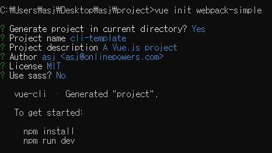
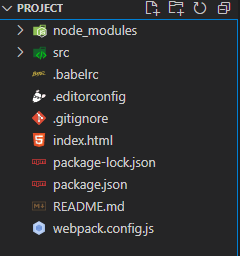
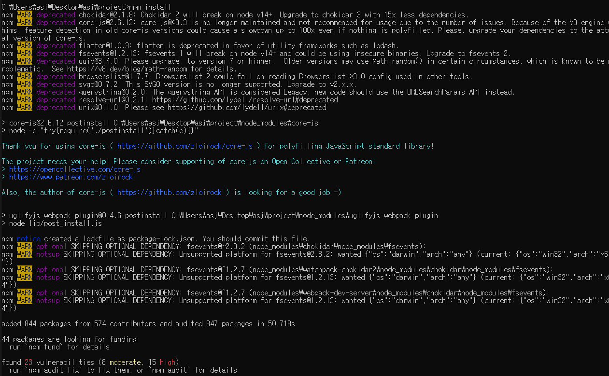
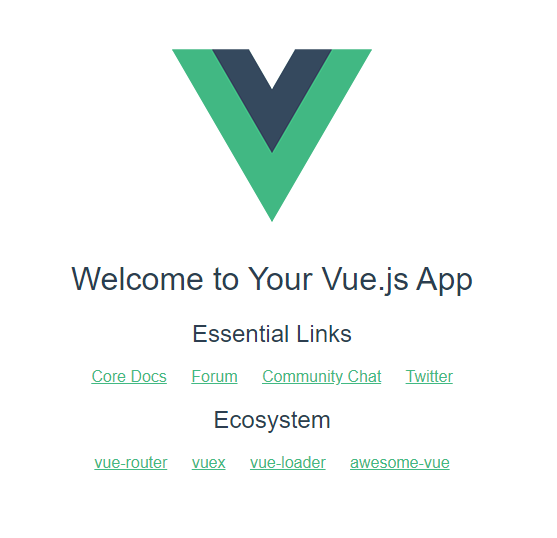
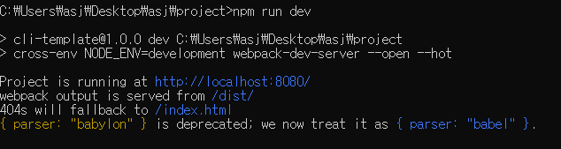

# 💡뷰 프로젝트 구성 방법

## 📝목차 
[01-1. HTML 파일에서 뷰 코드 작성 시의 한계점](#01-1-HTML-파일에서-뷰-코드-작성-시의-한계점)

[01-2. 싱글 파일 컴포넌트 체계](#01-2-싱글-파일-컴포넌트-체계)

[01-3. 뷰 CLI](#01-3-뷰-CLI)

[01-4. 뷰 CLI로 프로젝트 생성하기](#01-4-뷰-CLI로-프로젝트생성하기)


<br><br>

## 01. 뷰 프로젝트 구성 방법
### 01-1. HTML 파일에서 뷰 코드 작성 시의 한계점

```html
...
<div id="app">
   <my-component></my-component>
   <your-component></your-component>
<div>
...
<script>
	Vue.componet('my-component', {
		template: `<div id="app"><h1>{{ msg }}</h1><h2>Essential Links</h2><ul><li><a href="https://vuejs.org" target="_blank">Core Docs</a></li><li><a href="https://forum.vuejs.org" target="_blank">Forum</a></li><li><a href="https://chat.vuejs.org" target="_blank">Community Chat</a></li><li><a href="https://twitter.com/vuejs" target="_blank">Twitter</a></li></ul><h2>Ecosystem</h2><ul><li><a href="http://router.vuejs.org/" target="_blank">vue-router</a></li><li><a href="http://vuex.vuejs.org/" target="_blank">vuex</a></li><li><a href="http://vue-loader.vuejs.org/" target="_blank">vue-loader</a></li><li><a href="https://github.com/vuejs/awesome-vue" target="_blank">awesome-vue</a></li></ul></div>`
	});
	Vue.componet('your-component', {
		template: `<div id="app"><h1>{{ msg }}</h1><h2>Essential Links</h2><ul><li><a href="https://vuejs.org" target="_blank">Core Docs</a></li><li><a href="https://forum.vuejs.org" target="_blank">Forum</a></li><li><a href="https://chat.vuejs.org" target="_blank">Community Chat</a></li><li><a href="https://twitter.com/vuejs" target="_blank">Twitter</a></li></ul></div>`
	});
	
	new Vue({
	   el:'#app',
	   data: {
		message:'click this button'
	   }
	});
</script>
...
```

* template 속성에 작성된 HTML코드를 바로 분석하기가 쉽지 않다. 
* <script>태그 안에서 HTML코드는 구문 강조가 적용되지 않기 떄문에 오탈자를 찾기가 어렵다.
* 코드 들여쓰기도 어려워 상위 태그와 하위 태그의 관계를 파악하기 어렵다.

<br>

### 01-2. 싱글 파일 컴포넌트 체계
* 싱글 파일 컴포넌트란?
  + .vue 파일로 프로젝트 구조를 구성하는 방식을 말한다. 
  + 확장자 .vue파일 1개는 뷰 애플리케이션을 구성하는 1개의 컴포넌트와 동일하다.

* .vue 파일 기본 구조
```html
	<template>
	   <!-- HTML 태그 내용 -->
	</template>
	
	<script>
	   export default{
		// 자바스크립트 내용	
	   }
	</script>
	
	<style>
           /* css 스타일 내용 */
	</style>	
```

<br>

### 01-3. 뷰 CLI
* 싱글 컴포넌트 체계를 사용하기 위해서는 .vue 파일을 웹 브라우저가 인식할 수 있는 파일로 변환해주는 도구가 필요하다.
  + ex. 웹팩(웹앱의 자원을 자바스크립트모듈로 변환), 브라우저파이(웹팩과 비슷한 모듈 번들러)
* 뷰 프로젝트를 쉽게 구성할 수 있게 **뷰 CLI(Command Line Interface) 도구**를 제공한다.
* CLI에서 제공하는 명령어를 이용하면 뷰 애플리케이션을 개발하기 위한 초기 프로젝트 구조를 쉽게 구성이 가능하다.
* 웹팩이나 브라우저파이 같은 모듈 번들러를 프로젝트 자체에 포함하여 바로 사용이 가능하다.
* **.vue** 파일을 HTML, css, javascript 파일로 변환해 주기 위한 뷰 로더를 포함하고 있다.

**뷰 CLI 설치**
	
* cmd 창에서 입력
  + vue-cli 설치  ``` npm install vue-cli -global ```
  + vue-cli 설치 여부 확인 ``` vue ``` 	

**뷰 CLI 명령어**
	
<figure>
    <table>
        <thead>
            <tr>
                <th>템플릿 종류</th>
                <th>설명</th>
            </tr>
        </thead>
        <tbody>
            <tr>
                <td>Vue init webpack</td>
                <td>고급 웹팩 기능을 활용한 프로젝트 구성 방식. 테스팅, 문법 검사 등을 지원</td>
            </tr>
            <tr>
                <td>Vue init webpack-simple</td>
                <td>웹팩 최소 기능을 활용한 프로젝트 구성 방식. 빠른 화면 프로토타이핑용</td>
            </tr>
		<tr>
                <td>Vue init browserify</td>
                <td>고급 브라우저리파이 기능을 활용한 프로젝트 구성 방식. 테스팅, 문법 검사 등을 지원</td>
            </tr>
		<tr>
                <td>Vue init browserify-simple</td>
                <td> 브라우저리파이 최소 기능을 활용한 프로젝트 구성 방식. 빠른 화면 프로토타이핑용</td>
            </tr>
		<tr>
                <td>Vue init simple</td>
                <td>최소 뷰 기능만 들어간 HTML 파일 1개 생성</td>
            </tr>
		<tr>
                <td>Vue init pwa</td>
                <td>웹팩 기반의 프로그레시브 웹 앱(PWA, Progressive Web App) 기능을 지원하는 뷰 프로젝트</td>
            </tr>
        </tbody>
    </table>
</figure>	

<br>

### 01-4. 뷰 CLI로 프로젝트 생성하기
01.뷰 프로젝트를 생성할 빈폴더를 생성하고 빈 폴더에서 cmd창을 열어 ``` vue init webpack-simple ``` 입력
* 명령어 입력 결과 화면
	


02. ``` npm install ``` 입력하여 뷰 애플리케이션을 구동하기 위한 관련 라이브러리를 모두 다운로드 한다.
* 프로젝트 기본 폴더 구조
	
	

* npm install 명령어 입력 결과 화면
	

	
03. ``` npm run dev ``` 를 실행하면 localhost:8080으로 접근하여 애플리케이션을 실행할 수 있다.
* npm run dev 실행한 뷰 애플리케이션 초기화면
	

	
* npm run dev 명령어 입력 결과 화면
	


* 맨 아래 3줄은 뷰 프로젝트가 ``` http://loaclhost:8080/ ``` 에 구동되고 있음을 알려주면서 웹팩 결과값(output)이 ``` /dist/ ``` 에서 제공됙 있다는 의미이다.

	
<br><br>
						  
						  
#### 참고 do it vue.js

