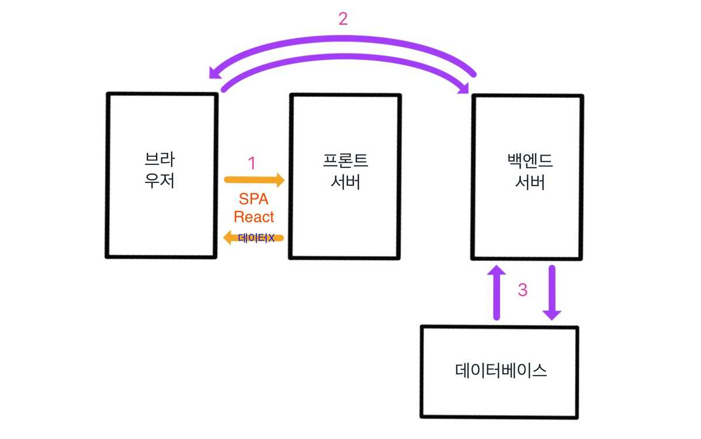
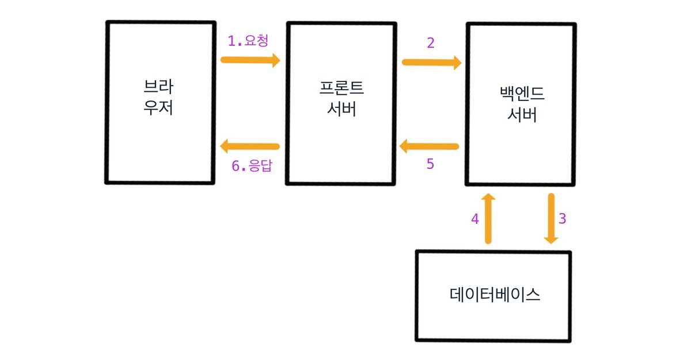

# 💡 서버 사이드 렌더링(SSR), 클라이언트 사이드 렌더링(CSR)

<br>

## 📝 목차
### [1. 클라이언트 사이드 렌더링(CSR)](1-SSR)
### [2. 서버 사이드 렌더링(SSR)](1-SSR)


<br>

## 1. 클라이언트 사이드 렌더링(CSR)
    다 그려져 있지 않은 HTML페이지를 브라우저에서 받고 프런트엔드 프레임워크(앵귤러, 뷰, 리액트)와 같은 
    자바스크립트를 이용하여 나버지 부분을 그리는 것을 의미한다. 
 
 ```html
<html>
  <head>
    <title>Vue client Side Rendering</title>
  </head> 
  <body>
    <div id="app">
      {{ message }}
    </div>
     
    <script src="https://cdn.jsdelivr.net/npm/vue@2.5.2/dist/vue.js"></script>
    <script>
      var cmp = {
        template: `<ul><li>item1</li><li>item2</li></ul>`
      };
      
      new Vue({
        el:'#app',
        data: {
          message: 'Hello Vue.js!'
        },
        components: {
          'list-component' : cmp
        }
      });
    </script>
  </body>
</html>
 ```
 
 - 서버에 보내준 HTML파일을 받았을 때, 브라우저가 이 HTML파일을 화면에 로딩하면서 뷰 프레임워크를 이용하여 인스턴스를 생성한다.
 - ```<ul>```태그와 ```<li>```태그를 템블릿 속성에 생성하여 화면에 붙여 넣는다.
 
 
 
 > (장점) 필요한 데이터만 백엔드에서 가져와 서버 부하가 덜하다.
 
 > (단점) js파일 다운로드로 초기 진입속도가 느릴 수 있다.  
 
 > (단점) SSR에 비해 SEO(검색 엔진 최적화)에 취약하다. 
 
 
 <br>
 
## 2. 서버 사이드 렌더링(SSR)
    완벽히 그려진 HTML페이지를 브라우저에서 받는 것을 의미한다. 
    
 ```html
<body>
  <div id="app">
    Hello Vue.js!
    <ul>
      <li>item1</li>
      <li>item2</li>
    </ul>
  </div>
</body>
 ```
 
 - 서버에서 브라우저로 HTML파일을 넘겨줄 때 화면에 나타낼 텍스트 값과 ```<ul>``` ```<li>```태그 가 이미 완벽하게 그려져 있다.
 - 브라우저에서는 해당 파일을 표시하기만 하면되고, 별도의 자바스크립트를 이용한 화면 랜더링은 필요하지 않다.




> (단점) 클릭으로 인한 다른 요청이 생길때마다 불필요한 부분까지 다시 렌더링 하게 되어 서버 부하 등의 문제가 발생할 수 있다. 

<br>


