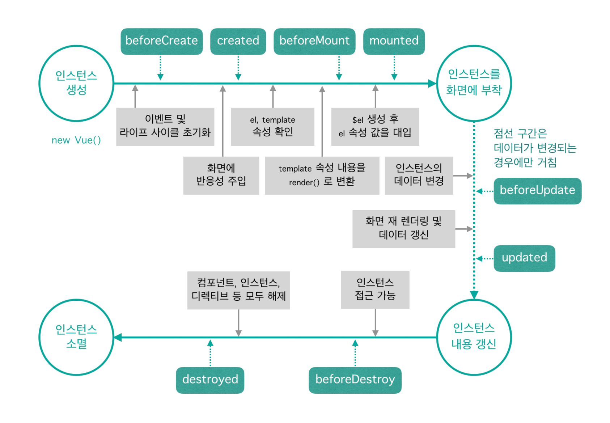

# 💡인스턴스 & 컴포넌트

## 📝목차 
[01. 뷰 인스턴스](#01-뷰-인스턴스)


[02. 뷰 컴포넌트](#02-뷰-컴포넌트)


[03. 뷰 컴포넌트 통신](#03-뷰-컴포넌트-통신)


<br><br>

## 01. 뷰 인스턴스 
### 01-1. 뷰 인스턴스의 정의와 속성
* 뷰로 화면을 개발하기 위해 필수적으로 생성해야하는 기본 단위
```javascript

new Vue({
	...
});

```
* 생성자 : 객체를 새로 생성할 때 자주 사용하는 옵션과 기능들을 미리 특정 개체에 저장해 놓고, 새로 개체를 생성할 때 기존에 포함된 기능과 더불어 기존 기능을 쉽게 확장하여 사용하는 기법

### 01-2. 뷰 인스턴스 옵션 속성
* **data** : 
* **el** : 
* **template** : 
* **method** :
* **created** : 

### 01-3. 뷰 인스턴스의 유효 범위
* el 속성으로 지정한<div id="app">태그 아래 오는 요소들로 제한, <div> 바깥에 있는 {{ message }}는 인식하지 못함
```javascript

new Vue({
	el : '#app',
  	data :  {
    	message : 'Hello Vue.js!'
  }
});

```
```html
  <div id="app"></div>
  {{ message }}
```  

### 01-4. 뷰 인스턴스 라이프 사이클
* 라이프 사이클: 인스턴스 상태에 따라 호출할 수 있는 속성들
* 라이프 사이클 단계: 생성 -> 부착 -> 갱신 -> 소멸


		
- **beforeCreate**
: 인스턴스가 생성되고 나서 가장 처음으로 실행되는 라이프 사이클 단계, data속성과 metods속성이 아직 정의되어 있지 않고, 돔과 같은 화면 요소에 접근할 수 없음 

- **created** 
: data속성과 metods속성에 정의된 값에 접근하여 로직을 실행 할 수 있지만, 인스턴스가 화면요소에 부착되기 전이기 때문에 template속성에 정의된 돔 요소로 접근할 수 없음

- **beforeMount**
: template속성에 지정한 마크업 속성을 render()함수로 변환 후 el속성에 지정한 화면 요소에 인스턴스를 부착하기 전에 호출되는 단계

- **mounted**
: el속성에 지정한 화면 요소에 인스턴스가 부착되면 호출되는 단계

- **beforeUpdate**
: el속성에서 지정한 화면 요소에 인스턴스가 부착되고 나면 인스턴스에 정의한 속성들이 화면에 지환

- **updated**
: 데이터가 변경되고 나서 가상 돔으로 다시 화면을 그리고 나면 실행되는 단계 (데이터 변경이 일어나 화면이 다시 그려졌을 때 호출됨)

- **beforeDestroy** 
: 뷰 인스턴스가 파괴되기 직전에 호출되는 단계, 아직 인스턴스에 접근할 수 있음 

- **destroy**
: 뷰 인스턴스가 파괴되고 나서 호출되는 단계, 뷰 인스턴스에 정의된 모든 속성이 제거되고 하위에 선언한 인스턴스들 또한 모두 파괴된다
  

<br><br>

## 02. 뷰 컴포넌트
### 02-1. 컴포넌트 란?
* 조합하여 화면을 구성할 수 있는 블록

### 02-2. 컴포넌트 등록하기
* **전역 컴포넌트** 
```javascript
Vue.component('컴포넌트 이름', {
	// 컴포넌트 내용
});
```
	
* **지역 컴포넌트** : 인스턴스 component 속성을 추가하고 등록할 컴포넌트 이름과 내용을 정의
```javascript
new Vue({
	components: {
		'컴포넌트 이름' :  컴포넌트 내용
	}	
});
```
```html
<div id="app>
        <h3>첫 번째 인스턴스 영역</h3>
        <button>컴포넌트 등록</button>
        <!-- 전역 컴포넌트 표시 -->
        <my-component></my-component> 
        <!-- 지역 컴포넌트 표시 -->
        <my-local-component></my-local-component> 
</div>
 <hr>
<div id="app2">
    <h3>두번째 인스턴스 영역</h3>
    <button>컴포넌트 등록</button>
    <!-- 전역 컴포넌트 표시 -->
    <my-component></my-component> 
    <!-- 지역 컴포넌트 표시 -->
    <my-local-component></my-local-component> 
</div>

<script>
    //전역 컴포넌트 등록
    Vue.component('my-component' ,{
        template: '<div>전역 컴포넌트가 등록되었습니다!</div>'
    });

    //지역 컴포넌트 등록
    var cmp = {
        template:'<div>지역 컴포넌트가 등록되었습니다!</div>' //컴포넌트 내용
    };

    new Vue({
        el:'#app',
        components:{ // 지역 컴포넌트 등록
            'my-local-component': cmp
        }
    });
    new Vue({
        el:'#app2' 
    });
</script>	

```
	
### 02-3. 지역 컴포넌트와 전역 컴포넌트의 차이 

<br><br>

## 03. 뷰 컴포넌트 통신 

<br><br>
